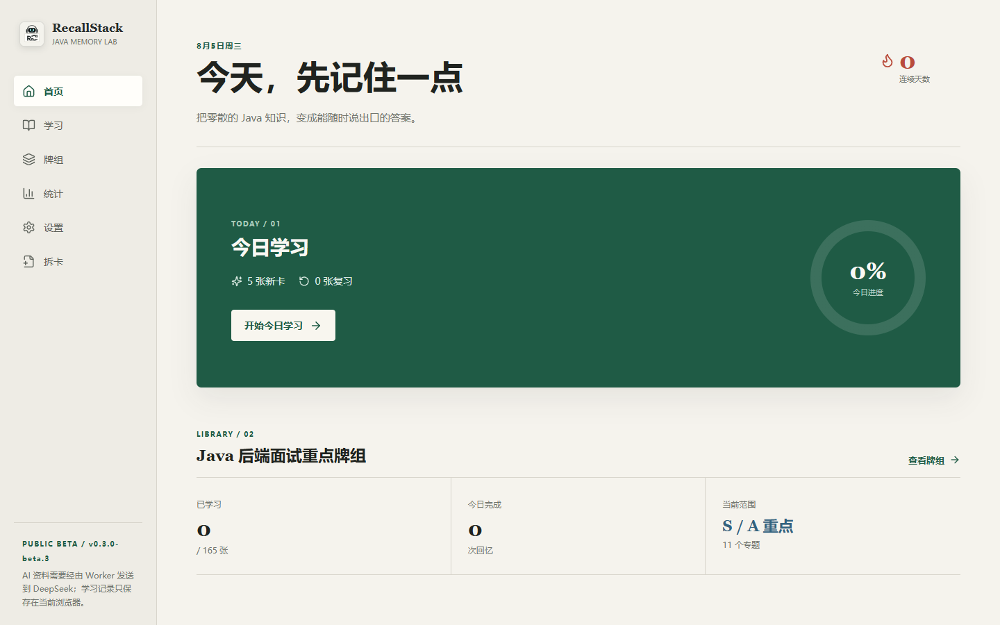
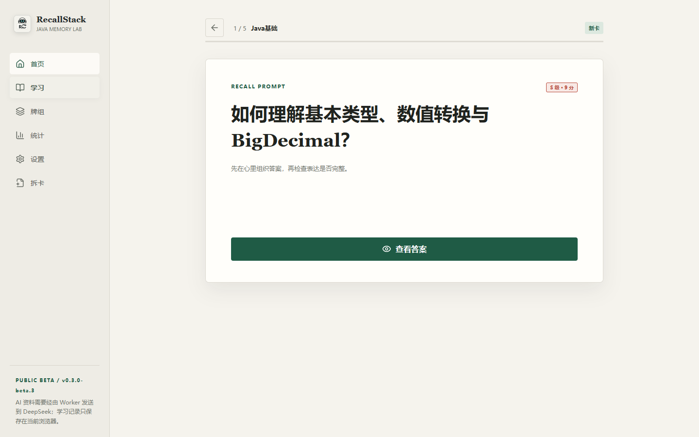
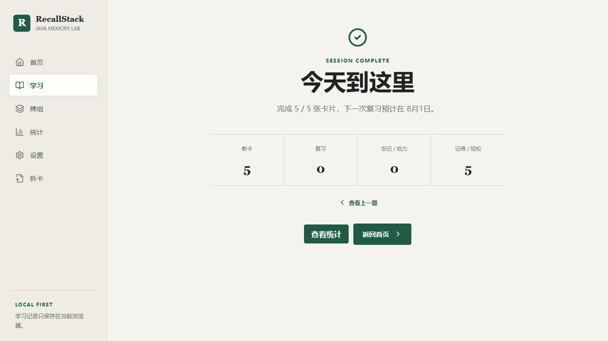
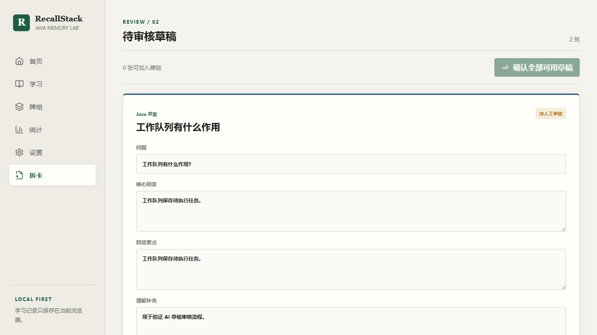
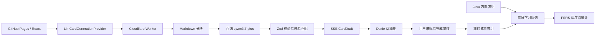

# RecallStack

[在线 Demo](https://qixiang0530-dot.github.io/RecallStack/) | 当前版本：`v0.3.0-beta.1`

RecallStack 是一个采用背单词式流程的主动回忆工具。它内置 165 张 Java 后端面试重点卡片，并支持把 Markdown 或纯文本资料拆成可编辑、可追溯的知识卡片草稿，再交给同一套 FSRS 学习流程。

> Beta 说明：v0.3 新增基于 Cloudflare Worker 和阿里云百炼 `qwen3.7-plus` 的 AI 智能拆卡。AI 输出必须经用户审核才能进入个人牌组；项目同时保留完全离线的本地规则模式。

## 五分钟体验

1. 打开在线 Demo，完成三步首次引导。
2. 学习一张 Java 卡片：按 `Space` 展开答案，再用 `1-4` 评分。
3. 使用“查看上一题”修正刚才的评分。
4. 在“拆卡”页选择 AI 模式，粘贴 Markdown 并生成草稿。
5. 检查来源片段和模型备注，点击“完成审核”，再加入“我的资料牌组”。

## 关键界面

| 今日任务 | 主动回忆 |
| --- | --- |
|  |  |

| 学习总结 | 资料拆卡审核 |
| --- | --- |
|  |  |

## 核心能力

- 主动回忆、答案分层、四档掌握评分和 FSRS 间隔重复
- Java 内置牌组与个人资料牌组隔离
- AI 智能拆卡与本地规则拆卡双模式
- Markdown 标题分块、SSE 进度、取消和失败分块重试
- 来源原文、置信度、生成备注、模型和 Prompt 版本展示
- AI 草稿强制人工审核，内容 Hash 辅助重复检测
- IndexedDB 持久化、v1/v2 JSON 备份兼容和 PWA 缓存
- 桌面与移动端响应式操作，Playwright 覆盖 Chrome 和 Pixel 7

## 架构与数据流



`CardGenerationProvider` 隔离生成策略。`LocalMarkdownProvider` 完全在浏览器运行；`LlmCardGenerationProvider` 只连接 Worker。Worker 无法访问 Dexie，也没有正式牌组写入能力。

## 本地运行

要求 Node.js 20 或更高版本。

```bash
npm install
npm run dev
```

未配置 Worker URL 时，AI 模式会禁用，本地规则模式仍可完整使用。联调已部署 Worker 时，在仓库根目录创建仅供本机使用的 `.env.local`：

```text
VITE_CARD_GENERATION_API_URL=https://your-worker.workers.dev/api/card-generation
```

不要把百炼 API Key 写入 `.env.local`，前端只需要公开的 Worker URL。

## Worker 部署

当前不需要提前修改代码。创建 Cloudflare 账号并验证邮箱后，在仓库根目录依次执行：

```bash
npx wrangler login
npx wrangler secret put DASHSCOPE_API_KEY --config worker/wrangler.toml
npm run worker:deploy
```

第二条命令会在终端提示你粘贴百炼 API Key；输入不会写入仓库。部署成功后记录 `https://...workers.dev` 地址，并在 GitHub 仓库执行：

1. 打开 `Settings -> Secrets and variables -> Actions -> Variables`。
2. 新建变量 `VITE_CARD_GENERATION_API_URL`。
3. 值填写 `https://...workers.dev/api/card-generation`。
4. 打开 `Actions -> Deploy to GitHub Pages -> Run workflow` 重新部署。

本地 Worker 调试使用 `npm run worker:dev`。如需覆盖百炼兼容地址，可在 Worker 环境变量中配置 `DASHSCOPE_BASE_URL`。

## 隐私与费用边界

- AI 模式会在用户同意后把本次资料发送到 Cloudflare 和阿里云百炼。
- Worker 不持久化原始资料或完整模型响应，只处理当前请求。
- API Key 只保存为 Cloudflare Secret，不进入浏览器、GitHub Pages 或备份文件。
- 单次最多 60,000 字符、10 个分块和 30 张草稿；每个 IP 每分钟最多 5 次生成请求。
- AI 输出可能不准确；来源片段、低置信度和生成备注用于确定审核优先级。
- 刷新页面后不保留上传全文；已通过 SSE 写入 Dexie 的草稿仍会保留。

## 验证命令

```bash
npm run lint
npm test
npm run worker:test
npm run build
npm run test:e2e
```

CI 中的 AI E2E 使用 Mock Worker，不调用真实百炼额度。真实 Worker smoke test 只在部署后手动执行一次。

## v0.3 Changelog

- 新增 `LlmCardGenerationProvider`、Cloudflare Worker 和百炼 `qwen3.7-plus` 接入
- 新增 Markdown 分块、SSE 增量草稿、取消和失败块重试
- 新增来源片段、置信度、生成备注、模型与 Prompt 版本
- 新增 AI 隐私同意、显式审核和内容 Hash 去重
- 数据库迁移到 v4，备份格式升级到 v2 并兼容 v1
- 新增 Worker 单测、类型检查和桌面/Pixel 7 Mock Worker E2E

## 当前限制与 Roadmap

- 当前仅支持 Markdown 和纯文本，不支持 PDF、DOCX 或网络地址。
- 无账号、云同步、社区和多人协作；个人数据仍只保存在当前浏览器。
- v0.3 不包含 RAG 或向量数据库。v0.4 将在真实拆卡质量和成本数据稳定后，再评估资料检索、引用增强和问答边界。

Agent 协作与工程边界见 [docs/agent-workflow.md](docs/agent-workflow.md)。
