# RecallStack

[在线 Demo](https://qixiang0530-dot.github.io/RecallStack/) | [GitHub 仓库](https://github.com/qixiang0530-dot/RecallStack) | `v0.3.0-beta.2`

RecallStack 是一个把“背单词式主动回忆”用于 Java 八股和个人资料复习的 Web/PWA 工具。它保留 Java 示例牌组，也支持把 Markdown 或纯文本交给本地规则或 DeepSeek AI 拆成可审核的知识卡片。

> **公开 Beta**：AI 生成内容必须人工审核。AI 服务有每日额度和访问频率限制，请不要上传公司内部资料、密钥或其他敏感内容。

## 五分钟体验

1. 打开在线 Demo，完成首次引导或点击“直接体验 Java Demo”。
2. 在学习页按 `Space` 查看答案，再用 `1-4` 评价掌握度。
3. 打开“拆卡”，点击“载入 Java 线程池示例”。
4. 选择“AI 智能拆卡”，同意资料发送说明后生成草稿。
5. 检查来源片段、置信度和模型备注，编辑后点击“完成审核”，再加入个人资料牌组。

## 核心闭环

```text
今日任务 -> 主动回忆 -> 查看答案 -> 四档评分 -> FSRS 安排复习

Markdown/纯文本 -> Worker 分块 -> DeepSeek 结构化生成
-> Zod 校验 -> 来源片段匹配 -> 草稿审核 -> 个人牌组 -> FSRS 学习
```

AI 永远只写入草稿，不直接修改正式牌组。用户完成审核后，系统会按最终内容重新计算 Hash，并跳过重复卡片。

## 技术架构

```mermaid
flowchart LR
  A[GitHub Pages React] --> B[LlmCardGenerationProvider]
  B --> C[Cloudflare Worker]
  C --> D[Markdown 分块与输入限制]
  D --> E[DeepSeek V4 Flash]
  E --> F[Zod 校验与来源匹配]
  F --> G[SSE 草稿流]
  G --> H[浏览器 IndexedDB]
  H --> I[人工审核]
  I --> J[个人资料牌组]
  J --> K[FSRS 复习队列]
```



- React + TypeScript + Vite：页面和交互。
- Dexie + IndexedDB：当前浏览器本地数据。
- `ts-fsrs`：复习安排。
- Cloudflare Worker：隐藏模型密钥、限流、输入限制、预算保护和 SSE。
- DeepSeek OpenAI 兼容接口：`deepseek-v4-flash` 结构化生成。
- Zod：模型响应字段和来源片段的运行时校验。

## AI 公开限制

- 每个 IP 每分钟最多 2 次 AI 请求。
- 单次最多 12000 个字符、3 个分块、8 张卡片。
- 每日按 UTC 日期使用 KV 近似累计 token，达到 80000 token 软阈值后停止生成，为并发和计数延迟保留余量。
- 预算是保护额度的近似计数，不是账单精确值；Worker 不记录原文、完整 Prompt 或模型完整响应。
- 限流、预算或模型余额不足时，本地规则拆卡仍然可用。

## 隐私边界

选择 AI 模式并同意后，本次资料会发送到 RecallStack Cloudflare Worker，再转发到 DeepSeek。Worker 不访问浏览器 IndexedDB，也不保存完整原文。生成草稿、审核结果和学习数据保存在当前浏览器，可通过应用内备份导出。

当前版本不提供账号、云同步、多人协作或删除云端历史的能力，因此请勿上传敏感资料。AI 输出可能错误，来源片段和人工审核是进入牌组前的必要步骤。

## 本地运行

需要 Node.js 20 或更高版本：

```bash
npm install
npm run dev
```

没有配置 Worker URL 时，AI 模式会禁用，但本地规则模式完整可用。联调时在项目根目录创建 `.env.local`：

```text
VITE_CARD_GENERATION_API_URL=https://your-worker.workers.dev/api/card-generation
```

不要把 DeepSeek API Key 写入前端环境变量、GitHub Pages 或仓库。

## 部署 Worker

首次部署需要 Cloudflare 账号，并在浏览器完成授权：

```bash
npx wrangler login
npx wrangler kv namespace create DAILY_BUDGET --config worker/wrangler.toml
npx wrangler secret put DEEPSEEK_API_KEY --config worker/wrangler.toml
npm run worker:deploy
```

把 KV 命令返回的 namespace ID 写入 `worker/wrangler.toml`，取消并填写：

```toml
[[kv_namespaces]]
binding = "DAILY_BUDGET"
id = "your-namespace-id"
```

公共 Worker 需要保持 `REQUIRE_DAILY_BUDGET = "true"`。没有 KV binding 时，Worker 会返回 `BUDGET_NOT_CONFIGURED`，不会无保护地调用模型。紧急停用时把 `AI_GENERATION_ENABLED` 改为 `false` 后重新部署。

GitHub Pages 使用 Actions Variable `VITE_CARD_GENERATION_API_URL` 注入公开 Worker URL，不要配置 API Key。部署前可运行：

```bash
npm run worker:dev
npm run worker:test
npm run worker:deploy
```

真实线上 smoke test 只使用无敏感信息的短 Java 资料。使用 `wrangler tail` 时只检查请求耗时、分块数量、token 汇总和错误类型，不复制原文或完整响应。

## 常见问题

- **AI 模式不可选**：检查 Pages 构建变量 `VITE_CARD_GENERATION_API_URL`，重新运行 Pages 工作流。
- **返回 `BUDGET_NOT_CONFIGURED`**：KV namespace 未创建、ID 未填写或 Worker 未重新部署。
- **返回 `RATE_LIMITED`**：已触发每 IP 每分钟 2 次限制，等待窗口结束即可。
- **返回今日额度已用完**：使用本地规则模式，下一 UTC 日再测试 AI。
- **页面仍是旧版本**：强制刷新一次；当前版本会在页面加载时检查 Service Worker 更新并自动刷新。
- **生成失败**：缩短资料、避免敏感或指令型文本，并重试失败分块；模型余额不足时需要先检查 DeepSeek 账户。

## 验证命令

```bash
npm run lint
npm test
npm run worker:test
npm run build
npm run test:e2e
git diff --check
```

CI 的 E2E 使用 Mock Worker，不消耗真实 DeepSeek 额度。线上真实 smoke test 不放入 CI。

## v0.3.0-beta.2

- 从阿里云百炼迁移到 DeepSeek V4 Flash。
- 增加 Cloudflare 每 IP 限流、KV 每日 token 软预算和紧急停用开关。
- 收紧公开 Beta 的单次字符、分块和卡片数量上限。
- 增加请求体大小校验、余额不足提示和安全摘要日志。
- 增加 Java 线程池示例资料，首次体验不需要准备文件。
- 增加 DeepSeek 隐私说明、AI 状态、额度降级路径和 PWA 更新检查。
- 保留来源片段、Zod 校验、SSE 增量草稿和人工审核闭环。

## 当前限制与路线图

- 仅支持 Markdown 和纯文本，不支持 PDF、DOCX 或网页 URL。
- 不包含账号、云同步、社区、多人协作和 RAG/向量数据库。
- 个人数据只保存在当前浏览器。
- v0.4 再根据真实使用数据评估资料级检索、引用增强和问答边界。

反馈请优先使用 [GitHub Issues](https://github.com/qixiang0530-dot/RecallStack/issues)，并选择对应模板。

抖音公开测试素材清单见 [docs/public-beta-launch.md](docs/public-beta-launch.md)，Agent 工程边界见 [docs/agent-workflow.md](docs/agent-workflow.md)。
