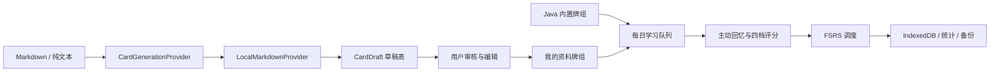

# RecallStack

[在线 Demo](https://qixiang0530-dot.github.io/RecallStack/) | 当前版本：`v0.2.0-beta.1`

RecallStack 是一个采用背单词式流程的主动回忆工具。它内置 165 张 Java 后端面试重点卡片，并提供一个完全本地的资料拆卡 Demo：用户可以导入 Markdown，审核规则生成的草稿，再把确认后的卡片交给同一套 FSRS 学习流程。

> Beta 说明：当前拆卡能力由确定性的本地规则实现，不是 LLM。应用不需要 API Key、后端或账号，所有数据只保存在当前浏览器。

## 五分钟体验

1. 打开在线 Demo，完成三步首次引导。
2. 学习一张 Java 卡片：先回忆，按 `Space` 展开答案，再用 `1-4` 评分。
3. 使用“查看上一题”修正刚才的评分。
4. 在“拆卡”页粘贴 Markdown，生成并编辑草稿。
5. 批量确认草稿，在“牌组”页切换到“我的资料牌组”。

## 关键界面

| 今日任务 | 主动回忆 |
| --- | --- |
|  |  |

| 学习总结 | 本地拆卡审核 |
| --- | --- |
|  |  |

## 核心能力

- 主动回忆、答案分层和四档掌握评分
- FSRS 间隔重复、每日冻结队列和刷新续学
- 仅查看并重评当前上一题，避免无限回看
- Java 内置牌组与个人资料牌组隔离
- Markdown 文件导入或文本粘贴
- 本地规则生成、逐张编辑、单张或批量确认
- 学习完成摘要、薄弱卡识别和未来 7 天复习预测
- IndexedDB 持久化、JSON 备份恢复和 PWA 离线缓存
- 桌面与移动端响应式操作，支持常用键盘快捷键

## 架构与数据流



`CardGenerationProvider` 是拆卡能力的工程边界。v0.2 默认实现 `LocalMarkdownProvider`；未来 LLM Provider 可以复用相同的草稿与审核闭环，但未经用户确认的生成内容不会进入正式牌组。

## 本地运行

要求 Node.js 20 或更高版本。

```bash
npm install
npm run dev
```

终端会显示桌面地址和局域网地址。同一局域网中的手机可以直接访问 Network 地址进行真机测试。

## 验证命令

```bash
npm run lint
npm test
npm run build
npm run test:e2e
```

测试栈包括 Vitest、React Testing Library 和 Playwright。E2E 同时运行桌面 Chrome 与 Pixel 7 项目。

## 数据与兼容性

Dexie 数据库保存牌组、卡片、草稿、FSRS 状态、复习日志、设置和每日会话。v3 迁移为旧牌组补充来源类型，为设置补充首次引导状态，同时保持已有学习状态不变。

JSON 备份包含个人牌组与未确认草稿，并兼容 v0.1 缺少这些字段的旧备份。导入内容会先通过 Zod 完整校验；校验失败时不会修改当前浏览器数据。

## v0.2 Changelog

- 增加三步首次引导、键盘操作和学习完成摘要
- 增加本地 Markdown 拆卡 Provider 与可编辑草稿工作流
- 增加个人资料牌组、牌组切换和批量确认
- 扩展数据库迁移与备份兼容
- 补充移动端布局、浏览器回归和作品展示文档

## 当前限制

- 拆卡使用本地规则，不具备真实 LLM 的语义理解能力
- 仅支持 Markdown 和纯文本，不支持 PDF、DOCX 或网络地址
- 无账号、云同步、社区和多人协作
- 个人数据只保存在当前浏览器，需要主动导出备份

## Roadmap

1. 在 `CardGenerationProvider` 边界接入真实 LLM，并保留强制人工审核。
2. 增加拆卡质量评估、来源引用和重复卡片检测。
3. 根据真实多设备需求评估账号与端到端加密同步。

Agent 协作与验证过程见 [docs/agent-workflow.md](docs/agent-workflow.md)。
